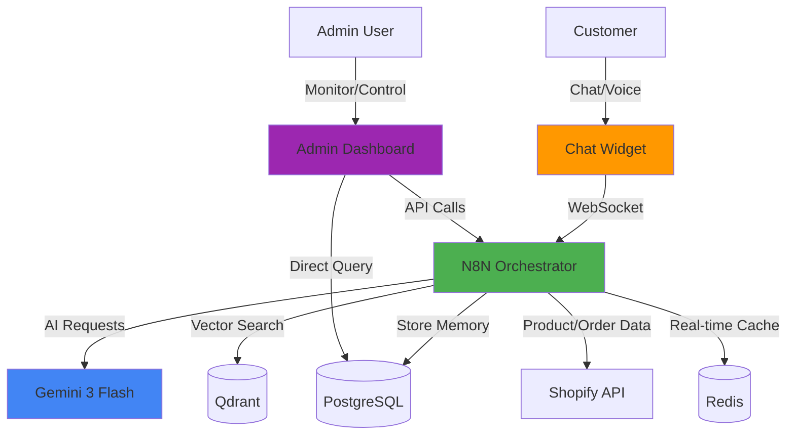
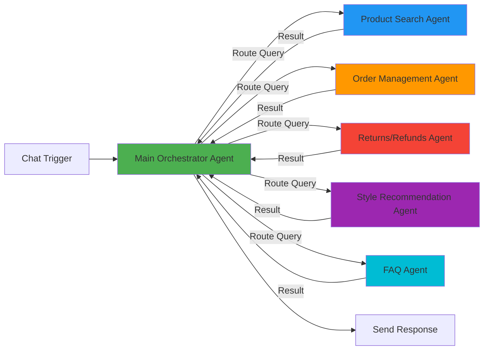
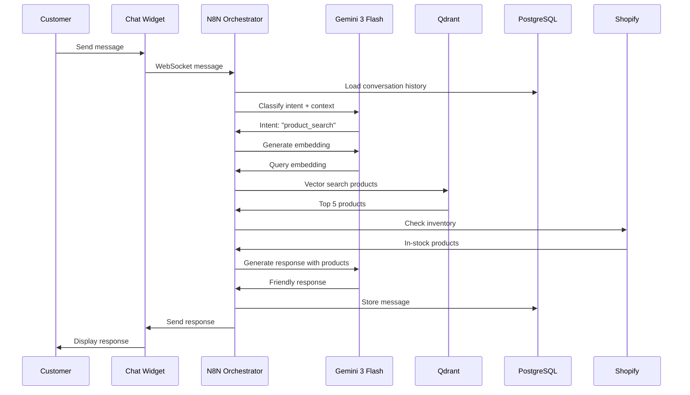
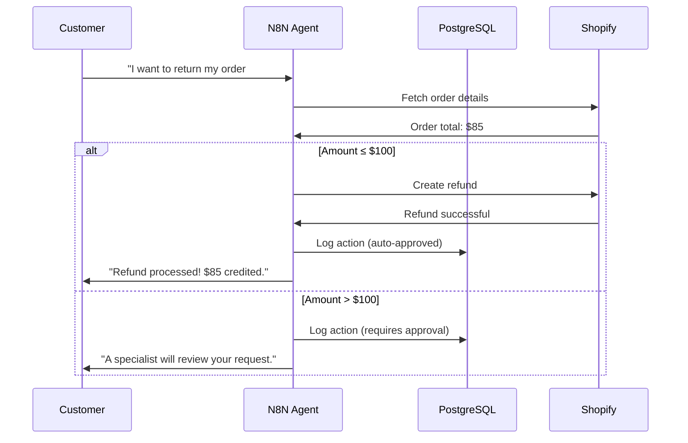
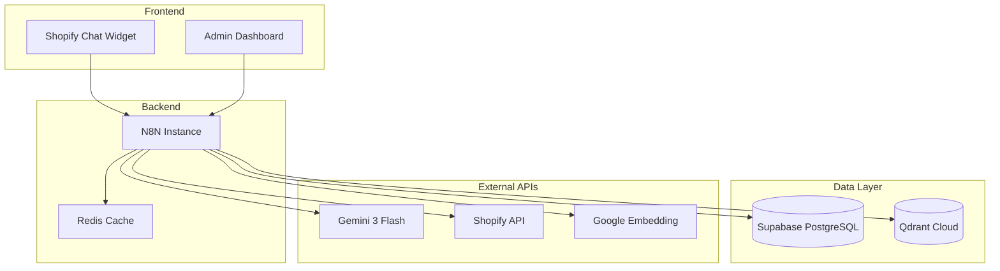

# System Architecture

**Project**: Customer Support Agent for Clothing Web Store  
**Version**: 1.0  
**Last Updated**: February 2, 2026

---

## High-Level Architecture



---

## Component Architecture

### 1. **Frontend Layer**

#### Chat Widget (React)
- **Location**: Embedded in all Shopify store pages
- **Features**:
  - Floating button (bottom-right)
  - Collapsible chat interface
  - Message history
  - Typing indicators
  - File upload (for returns/issues)
  - Thumbs up/down feedback
  - Language selector
- **Technology**: React, WebSocket, Shopify App Bridge
- **Authentication**: Shopify customer session

#### Admin Dashboard (Next.js)
- **Features**:
  - Real-time conversation monitoring
  - Agent performance metrics
  - Manual conversation takeover
  - FAQ management
  - Agent configuration
  - Analytics dashboard
- **Technology**: Next.js, React, TailwindCSS
- **Authentication**: JWT-based admin auth

---

### 2. **Backend Layer - N8N Multi-Agent System**



#### Main Orchestrator Agent
**Responsibilities**:
- Receive user messages
- Classify intent (product search, order status, FAQ, etc.)
- Route to appropriate specialist agent
- Maintain conversation context
- Synthesize multi-agent responses
- Handle escalations
- Update conversation memory

**N8N Workflow**:
```
[Chat Trigger] 
→ [Load Conversation History] 
→ [Intent Classification (Gemini)]
→ [Route to Sub-Agent]
→ [Aggregate Results]
→ [Generate Response (Gemini)]
→ [Store Message]
→ [Send to Customer]
```

#### Specialist Agents

##### Product Search Agent
- Semantic product search using vector DB
- Filter by size, color, price, category
- Provide product recommendations
- Check inventory availability

##### Order Management Agent
- Fetch order details from Shopify
- Provide order status updates
- Track shipments
- Modify orders (if allowed)

##### Returns/Refunds Agent
- Process return requests
- Auto-approve refunds under $100
- Create return labels
- Update order status
- Escalate high-value returns

##### Style Recommendation Agent
- Analyze customer preferences
- Suggest outfit combinations
- Provide styling tips
- Personalized product recommendations

##### FAQ Agent
- Retrieve relevant FAQs using RAG
- Provide policy information
- Answer common questions

---

### 3. **Data Layer**

#### PostgreSQL (Supabase)
**Purpose**: Primary data store
- Conversation history
- Customer profiles
- Agent actions log
- Analytics data

**Extensions**:
- `uuid-ossp`: UUID generation
- `pgvector`: Vector similarity search

#### Qdrant Cloud
**Purpose**: Vector database for RAG
- Product embeddings (768-dim)
- FAQ embeddings
- Policy document embeddings

**Collections**:
- `products`: ~1000 clothing items
- `faqs`: ~100 common questions
- `policies`: Return, shipping, payment policies

#### Redis
**Purpose**: Real-time session cache
- Active conversation context
- Temporary user state
- Rate limiting
- WebSocket connection mapping

---

### 4. **External Services**

#### Shopify API
**Integration**:
- Custom Shopify App
- OAuth authentication
- Webhooks for real-time updates

**Used APIs**:
- Products API (search, details, inventory)
- Orders API (fetch, modify)
- Customers API (profile sync)

#### Gemini 3 Flash API
**Usage**:
- Intent classification
- Response generation
- Sentiment analysis
- Language translation

**Configuration**:
- Model: `gemini-3-flash`
- Temperature: 0.7
- Max tokens: 1024
- System prompts per agent

#### Google Embedding API
**Usage**:
- Embed product descriptions
- Embed FAQs
- Embed user queries

**Model**: `text-embedding-004` (768 dimensions)

---

## Data Flow

### User Message Flow


### Autonomous Action Flow (Refund Example)


---

## Security Architecture

### Authentication
- **Customers**: Shopify OAuth (session-based)
- **Admin**: JWT tokens with role-based access
- **N8N**: API key authentication
- **External APIs**: Environment variables (never in code)

### Data Protection
- All API keys in environment variables
- Database connections over SSL
- Passwords hashed with bcrypt
- Sensitive data encrypted at rest

### Rate Limiting
- Per-user: 30 messages/minute
- Per-IP: 100 requests/minute
- Gemini API: Respect free tier limits

---

## Scalability Considerations

### Current Setup (MVP)
- Single N8N instance
- Supabase free tier (10GB)
- Qdrant free tier (1M vectors)
- Expected load: 10-50 concurrent users

### Future Scaling
- N8N: Horizontal scaling with worker nodes
- PostgreSQL: Read replicas, connection pooling
- Redis: Cluster mode for high availability
- Qdrant: Upgrade to paid tier or self-hosted

---

## Monitoring & Observability

### Metrics to Track
- Response time (target: <2s)
- Conversation resolution rate
- Escalation rate
- Customer satisfaction (thumbs up/down)
- Gemini API usage (stay within free tier)

### Logging
- N8N execution logs
- PostgreSQL query logs
- API request/response logs
- Error tracking

---

## Deployment Architecture



### Hosting
- **N8N**: Self-hosted (local for dev, VPS for production)
- **Chat Widget**: Shopify-hosted (embedded app)
- **Admin Dashboard**: Vercel/Netlify (free tier)
- **PostgreSQL**: Supabase (managed)
- **Qdrant**: Cloud (managed)
- **Redis**: Local/Upstash free tier

---

## Technology Decisions

| Decision | Rationale |
|----------|-----------|
| N8N over custom backend | Visual workflow builder, built-in AI nodes, HITL support |
| PostgreSQL + pgvector | Single database for both relational and vector data |
| Qdrant as primary vector DB | Free tier, easy setup, better performance than ChromaDB cloud |
| Gemini 3 Flash | Latest model, free tier, agentic capabilities |
| React for widget | Component reusability, Shopify App Bridge support |
| Next.js for admin | Full-stack framework, API routes, fast |

---

**Next Steps**:
1. Create N8N workflow diagrams for each agent
2. Set up Supabase project and run migrations
3. Create Qdrant collections
4. Build chat widget MVP
5. Implement orchestrator agent in N8N
